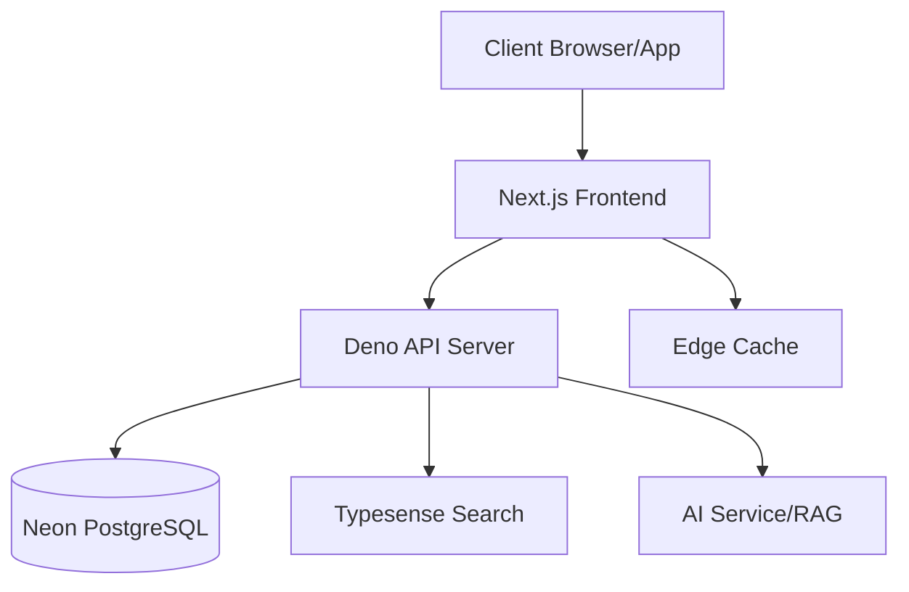
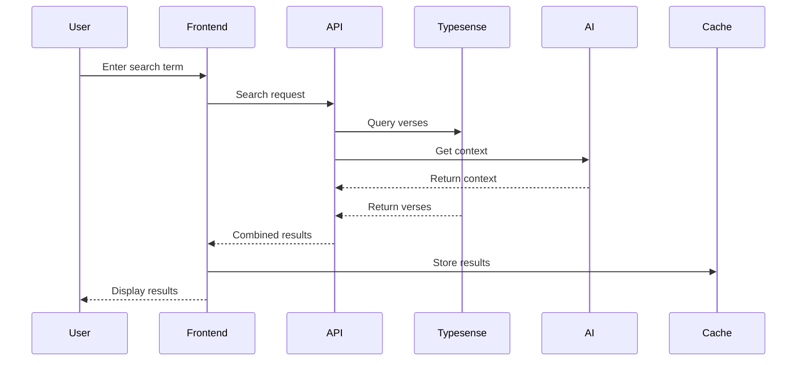
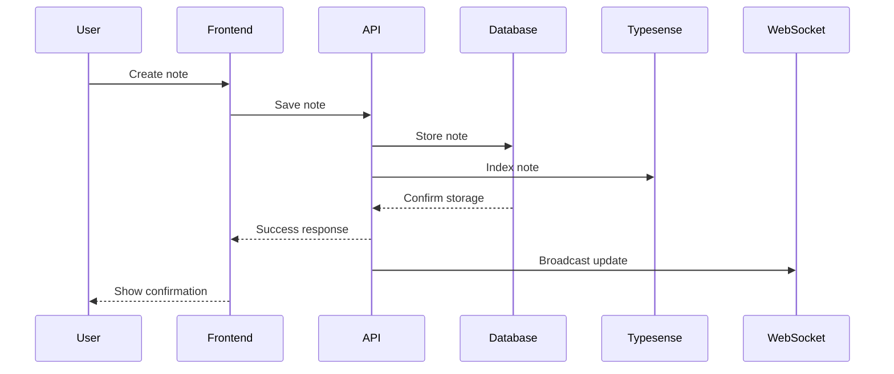

# Architecture Overview

## System Architecture

## Component Details

### 1. Client Browser/App
- **Description**: The user-facing interface where believers interact with the Bible study platform
- **Technologies**:
  - Modern web browsers (Chrome, Firefox, Safari)
  - Progressive Web App (PWA) support
  - Mobile-responsive design
- **Responsibilities**:
  - Rendering user interface
  - Handling user interactions
  - Managing local state
  - Offline functionality
  - Local storage for preferences

### 2. Next.js Frontend
- **Description**: Server-side rendered React application providing the main user interface
- **Key Features**:
  - Server-side rendering for fast initial load
  - Client-side navigation for smooth transitions
  - Static page generation for documentation
  - API route handlers for backend communication
- **Core Components**:
  - Bible reader interface
  - Study tools
  - User authentication forms
  - Settings management
  - Search interface

### 3. Deno API Server
- **Description**: Backend server handling business logic and data management
- **Technologies**:
  - Deno runtime
  - Hono web framework
  - JWT authentication
  - WebSocket support
- **Key Services**:
  - User authentication
  - Data validation
  - Business logic
  - External service coordination
  - Real-time updates

### 4. Neon PostgreSQL
- **Description**: Cloud-native PostgreSQL database for persistent data storage
- **Data Models**:
  - User accounts and profiles
  - Bible texts and translations
  - Study notes and highlights
  - Progress tracking
  - User preferences
- **Features**:
  - Automatic scaling
  - Point-in-time recovery
  - Serverless architecture
  - Built-in backups

### 5. Typesense Search
- **Description**: Fast, typo-tolerant search engine for Bible study content
- **Search Features**:
  - Verse search
  - Cross-reference lookup
  - Topic search
  - Study note search
- **Capabilities**:
  - Typo tolerance
  - Faceted search
  - Multi-language support
  - Real-time indexing

### 6. AI Service/RAG
- **Description**: AI-powered features using Retrieval Augmented Generation
- **Features**:
  - Historical context generation
  - Study suggestions
  - Cross-reference recommendations
  - Topic exploration
- **Components**:
  - Vector database for semantic search
  - RAG pipeline for context-aware responses
  - Fine-tuned language models
  - Knowledge base integration

### 7. Edge Cache
- **Description**: Distributed caching system for improved performance
- **Caching Strategies**:
  - Static asset caching
  - API response caching
  - Bible text caching
  - User preference caching
- **Benefits**:
  - Reduced latency
  - Lower server load
  - Better offline support
  - Improved user experience

## Feature Flows

### Bible Search Example
1. User enters search term in the interface
2. Frontend sends request to API server
3. API server queries Typesense for relevant verses
4. AI service enhances results with context
5. Results are cached for future requests
6. Frontend displays formatted results

### Study Note Creation Example
1. User selects verse and adds note
2. Frontend validates input
3. API server processes request
4. Note stored in database
5. Search index updated
6. Real-time updates sent to other devices

## Security Architecture

### Authentication Flow
- JWT-based authentication
- HTTP-only cookies for token storage
- Refresh token rotation
- CSRF protection
- Rate limiting

### Data Protection
- End-to-end encryption for sensitive data
- Data encryption at rest
- Secure API endpoints
- Input validation
- XSS prevention

### Privacy Considerations
- GDPR compliance
- Data minimization
- User consent management
- Privacy-first design
- Regular security audits

## Performance Optimization

### Caching Strategy
1. **Browser Level**
   - Service worker caching
   - Local storage
   - IndexedDB for offline data

2. **CDN Level**
   - Static asset caching
   - Edge caching
   - Regional distribution

3. **Application Level**
   - API response caching
   - Database query caching
   - Search result caching

### Load Management
- Automatic scaling
- Load balancing
- Request queuing
- Background processing
- Resource optimization

## Development Workflow

### Local Development
1. Frontend development server
2. Backend development server
3. Local database instance
4. Mock AI services
5. Hot reloading

### Testing Environment
1. Automated testing
2. Integration testing
3. Performance testing
4. Security testing
5. User acceptance testing

### Production Deployment
1. CI/CD pipeline
2. Staged rollouts
3. Monitoring
4. Logging
5. Error tracking

## Scalability Considerations

### Horizontal Scaling
- Stateless API design
- Database sharding
- Load balancing
- Service redundancy

### Vertical Scaling
- Resource optimization
- Performance monitoring
- Capacity planning
- Database optimization

## Monitoring and Maintenance

### System Monitoring
- Error tracking
- Performance metrics
- User analytics
- Resource utilization
- Security monitoring

### Maintenance Procedures
- Regular backups
- Security updates
- Performance optimization
- Data cleanup
- System health checks

## Future Considerations

### Planned Improvements
- GraphQL API
- Real-time collaboration
- Enhanced AI features
- Mobile applications
- Additional language support

### Technical Debt Management
- Code refactoring
- Performance optimization
- Security hardening
- Documentation updates
- Test coverage improvement 